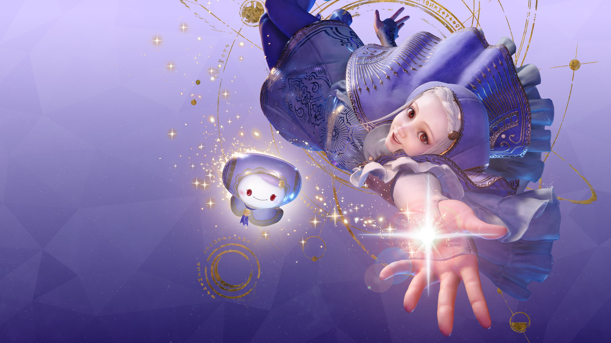

# Clash Verge — Ingrid Theme



> *灵感来源于《Street Fighter 6》中 Ingrid 的水晶幻境——她每一次瞬移都留下半透明的光晕，像凝固的玻璃碎片。这套 Clash Verge 主题把这种感觉搬到了代理面板上：每一张卡片都是一片"水晶"，底下透出您的壁纸。*

A frosted-glass CSS theme for [Clash Verge](https://github.com/clash-verge-rev/clash-verge-rev) inspired by **Ingrid** from *Street Fighter 6*. Every panel is a frozen shard of light, the wallpaper peeks through underneath, and the proxy list reads like a battlefield of crystalline teleports.

---

## ✨ Features

- **Frosted glass** on every card, dialog, and popover
- **Wallpaper bleeds across the entire window**, including the top title bar
- **Micro-tuned opacity**: you can still glimpse the wallpaper, but text never drowns
- **Force-bright secondary text** so node names next to "Selector" stay crisp
- **Easy re-skin** via CSS variables — change the wallpaper, accent colour, or panel density in one line
- Zero JavaScript, zero dependencies — pure CSS injection

---

## 📸 Preview

| Proxies page | Settings |
| --- | --- |
| *(drop a screenshot of `Proxies` here)* | *(drop a screenshot of `Settings` here)* |

You can also just open `wallpaper/wallpaper.jpg` to see the bundled background.

---

## 🚀 Installation

1. **Disable the system title bar** so the wallpaper can cover the top of the window:
   `Settings → Interface → 优先使用系统标题栏` → **off**
   *(the exact menu label depends on your Clash Verge language; it's the toggle that hides the native window decoration)*
2. Open Clash Verge → **Settings → Theme / 主题设置**
3. Find the **Custom CSS / 自定义 CSS** field
4. Paste the **entire** contents of [`theme.css`](./theme.css)
5. Save — the theme takes effect immediately

That's it. No restart needed.

---

## 🖼 Using your own wallpaper

The bundled wallpaper lives in `wallpaper/wallpaper.jpg`. To use your own:

1. Replace `wallpaper/wallpaper.jpg` with your image (keep the same filename, or update the path below)
2. Or change the path in `theme.css`:

```css
--cv-wallpaper: url("http://asset.localhost/$(pwd)/wallpaper/wallpaper.jpg");
```

Common path formats:

| OS | Example |
| --- | --- |
| Windows | `url("http://asset.localhost/C%3A%5CUsers%5CPublic%5CPictures%5Cmy-image.jpg")` |
| Linux | `url("file:///home/you/Pictures/my-image.jpg")` |
| macOS | `url("file:///Users/you/Pictures/my-image.jpg")` |

Tip: in Clash Verge's Custom CSS field, `$(pwd)` resolves to the directory of the CSS file, so you can ship the theme + wallpaper together.

---

## 🎨 Customisation cheat-sheet

All visual tweaks are CSS variables at the top of `theme.css`.

### Wallpaper
```css
--cv-wallpaper: url("...");  /* your image */
--cv-wp-filter: none;          /* e.g. blur(4px) brightness(0.85) */
--cv-scrim:    rgba(6, 8, 14, 0.10);  /* dark overlay on top of wallpaper */
```

### Glass density

| Variable | Default | Effect |
| --- | --- | --- |
| `--cv-panel` | `rgba(255,255,255,0.06)` | Card backgrounds |
| `--cv-subpanel` | `rgba(255,255,255,0.08)` | Inner lists |
| `--cv-row-bg` | `rgba(255,255,255,0.06)` | Proxy row strip |
| `--cv-chip-bg` | `rgba(255,255,255,0.14)` | Small tags |
| `--cv-input-bg` | `rgba(0,0,0,0.40)` | Input fields |
| `--cv-overlay-bg` | `rgba(18,20,28,0.86)` | Dialogs / menus |
| `--cv-tooltip-bg` | `rgba(13,15,22,0.96)` | Tooltips |
| `--cv-sticky-bg` | `rgba(10,12,18,0.65)` | Sticky bars |

> Increase the last number in each `rgba(...)` to make the surface **more opaque** (less wallpaper visible). Decrease it for a more ghostly look.

### Accent colour
```css
--cv-accent:  #5ab0f8;   /* primary highlight (selected, borders, underlines) */
--cv-success: #3fd3a8;   /* "connected" green */
--cv-error:   #ff6b80;   /* "failed" red */
```

### Geometry
```css
--cv-radius:  16px;  /* card corner radius */
--cv-gap:      5px;   /* spacing between rows */
--cv-row-pad:  12px;  /* vertical padding inside proxy cards */
--cv-border:   rgba(255,255,255,0.37);
```

---

## 🧠 How it works (in one paragraph)

`body::before` paints the wallpaper as a fixed background with `z-index: -2`. `body::after` adds a translucent dark scrim on top. Every MUI panel / card / list item is then forced to `background: transparent`, so the wallpaper shines through. A thin white border + soft shadow is layered on top to give the illusion of frosted glass without ever needing `backdrop-filter` (which is unreliable inside Tauri webviews).

The bottom of `theme.css` contains two surgical patches:

1. A **wide-net titlebar selector** that turns the custom (non-system) title bar fully transparent so the wallpaper flows edge-to-edge.
2. A **MUI Typography force-bright** rule that keeps the small node-name text next to "Selector" readable, without painting the whole card white on hover.

---

## 📁 File layout

```
clash-verge-ingrid-theme/
├── README.md
├── LICENSE
├── theme.css                # ← drop this into Clash Verge
└── wallpaper/
    └── wallpaper.jpg        # bundled background
```

---

## 📜 License

MIT — see [`LICENSE`](./LICENSE).

The bundled `wallpaper/wallpaper.jpg` is included for personal use only; please replace it before redistributing if you don't hold the rights to the image.

---

## 🙏 Credits

- Inspired by **Ingrid** from *Street Fighter 6* by Capcom
- Built for [Clash Verge](https://github.com/clash-verge-rev/clash-verge-rev) / [Clash Verge Rev](https://github.com/clash-verge-rev/clash-verge-rev)
- MIT, do whatever you want