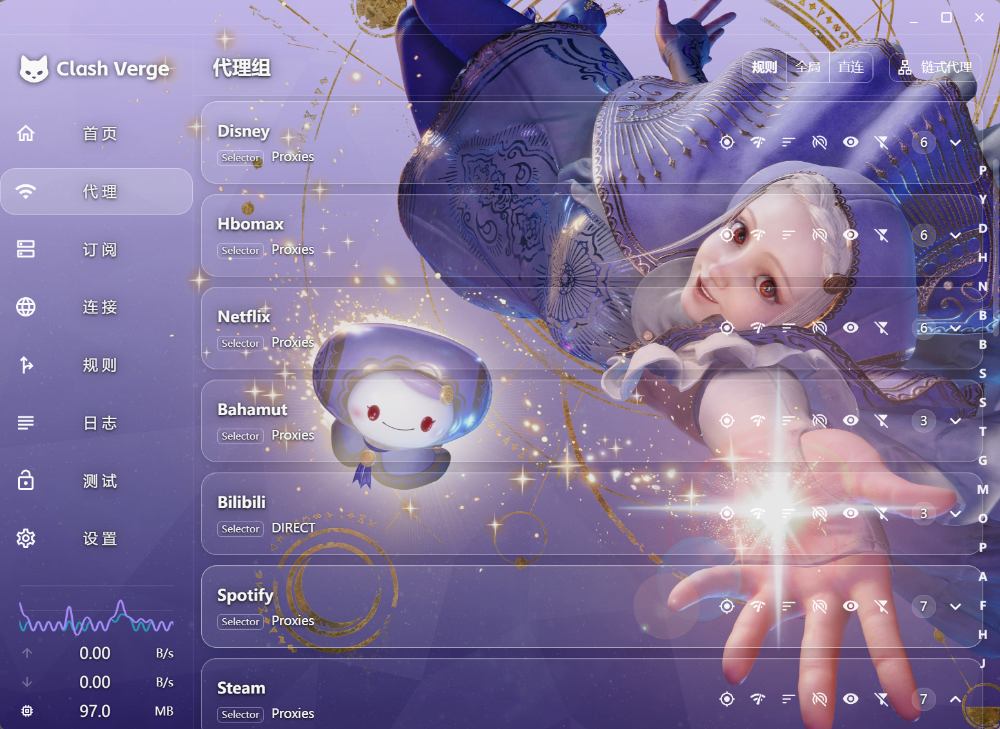
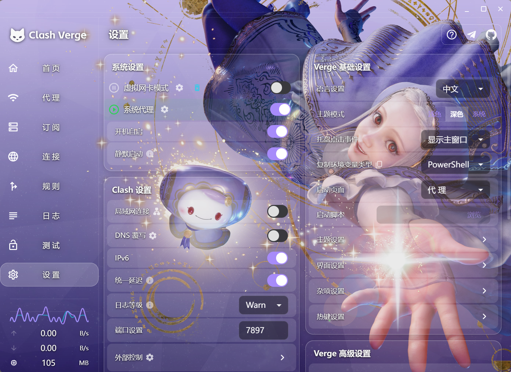
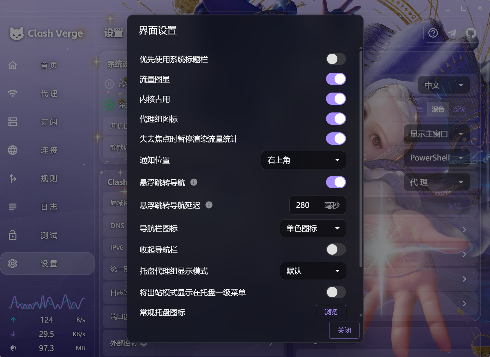
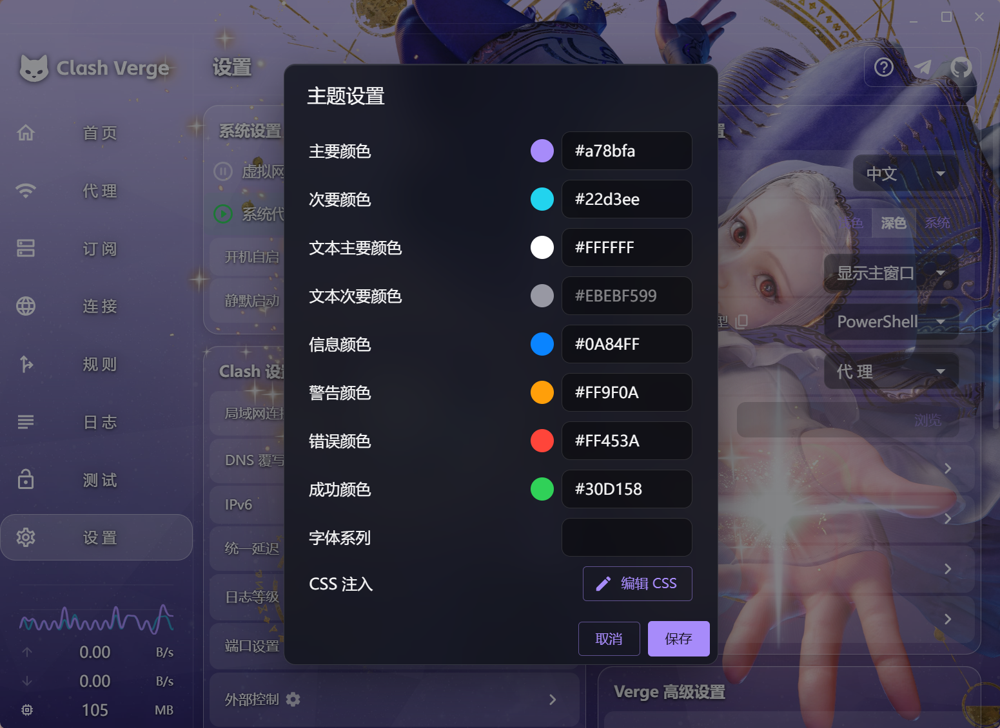

# Clash Verge — Ingrid 主题


> *灵感来源于《Street Fighter 6》中 Ingrid 的水晶幻境——她每一次瞬移都留下半透明的光晕，像凝固的玻璃碎片。这套 Clash Verge 主题把这种感觉搬到了代理面板上：每一张卡片都是一片"水晶"，底下透出您的壁纸。*

一套为 [Clash Verge](https://github.com/clash-verge-rev/clash-verge-rev) 设计的 CSS 注入主题，灵感来自《街头霸王 6》的角色 **Ingrid（英格丽德）**——每一次瞬移都留下半透明白色光晕，像凝固的水晶碎片。本仓库把这种感觉搬到了 Clash Verge 的代理面板上：每一张卡片都是一片"水晶"，底下透出您的壁纸。

---

## 📸 预览

### 代理页面



### 设置主页



---

## ✨ 主要特性

- **毛玻璃**效果覆盖每一张卡片、弹窗和菜单
- **壁纸铺满整个窗口**，包括最顶端的标题栏
- **微调透明度**：壁纸隐约可见，文字依然清晰
- **强制提亮次要文字**：Selector 旁边的节点名不再暗淡
- **一行换肤**：所有视觉调整都通过 CSS 变量控制——改壁纸、配色、磨砂程度都是一行的事
- **零依赖**：纯 CSS 注入，无 JavaScript、无外部资源

---

## 🚀 安装教程

### 第一步：关掉系统标题栏（**必须做**）

Clash Verge 默认使用**系统标题栏**，那一层在 WebView 之上，CSS 根本碰不到。要让壁纸覆盖整个窗口（包括最顶端），必须先把它关掉。

打开 **设置 → 界面设置**，把**第一项**关掉：

> **优先使用系统标题栏** → **关（OFF）**



> *说明：菜单的英文标签可能略有差异，例如 "Use system title bar"。关掉之后，标题栏就会变成 WebView 的一部分，本主题的 CSS 才能把它变透明，让壁纸真正铺满。*

### 第二步：粘贴主题 CSS

打开 **设置 → 主题设置**，找到 **CSS 注入** 一栏，点铅笔图标，把 [`theme.css`](./theme.css) 的**整份内容**粘贴进去，点击保存。

效果立刻生效，无需重启 Clash Verge。

下面是本主题在 **主题设置** 弹窗里的样子（供参考）：



---

## 🖼 替换成您自己的壁纸

仓库里默认带的壁纸在 `wallpaper/wallpaper.jpg`。换自己的壁纸有两种方式：

1. 直接用同名图片替换 `wallpaper/wallpaper.jpg`
2. 或者改 `theme.css` 里这一行的路径：

```css
--cv-wallpaper: url("http://asset.localhost/$(pwd)/wallpaper/wallpaper.jpg");
```

常见系统的路径写法：

| 系统 | 示例 |
| --- | --- |
| Windows | `url("http://asset.localhost/C%3A%5CUsers%5CPublic%5CPictures%5Cmy-image.jpg")` |
| Linux | `url("file:///home/yourname/Pictures/my-image.jpg")` |
| macOS | `url("file:///Users/yourname/Pictures/my-image.jpg")` |

> 提示：在 Clash Verge 的"自定义 CSS"输入框里，`$(pwd)` 会解析成 CSS 文件所在的目录，所以您可以直接把 CSS 和壁纸一起打包分发，使用者一行都不用改。

---

## 🎨 自定义速查表

所有视觉调整都集中在 `theme.css` 顶部的 CSS 变量里。

### 壁纸相关

```css
--cv-wallpaper: url("...");          /* 您的壁纸 */
--cv-wp-filter: none;                /* 例如：blur(4px) brightness(0.85) */
--cv-scrim:    rgba(6, 8, 14, 0.10); /* 壁纸上的暗化蒙版 */
```

### 毛玻璃浓度

| 变量 | 默认值 | 作用 |
| --- | --- | --- |
| `--cv-panel` | `rgba(255,255,255,0.06)` | 卡片底色 |
| `--cv-subpanel` | `rgba(255,255,255,0.08)` | 内层列表底色 |
| `--cv-row-bg` | `rgba(255,255,255,0.06)` | 代理行底色 |
| `--cv-chip-bg` | `rgba(255,255,255,0.14)` | 小标签底色 |
| `--cv-input-bg` | `rgba(0,0,0,0.40)` | 输入框底色 |
| `--cv-overlay-bg` | `rgba(18,20,28,0.86)` | 弹窗/菜单底色 |
| `--cv-tooltip-bg` | `rgba(13,15,22,0.96)` | 悬浮提示底色 |
| `--cv-sticky-bg` | `rgba(10,12,18,0.65)` | 粘性条底色 |

> 想要更不透明（壁纸少露一点）→ 把 `rgba(...)` 里最后一个数字调大；想要更梦幻 → 调小。

### 强调色

```css
--cv-accent:  #5ab0f8;   /* 主色（选中态、下划线、强调边框） */
--cv-success: #3fd3a8;   /* "已连接" 绿色 */
--cv-error:   #ff6b80;   /* "失败" 红色 */
```

### 几何参数

```css
--cv-radius:  16px;  /* 卡片圆角 */
--cv-gap:      5px;  /* 行间距 */
--cv-row-pad:  12px; /* 代理卡片内边距 */
--cv-border:   rgba(255,255,255,0.37); /* 边框颜色 */
```

---

## 🧠 原理（30 秒版）

- `body::before` 用 `z-index: -2` 把壁纸画成 fixed 背景，铺满整个视口
- `body::after` 在壁纸之上叠一层极淡的暗化蒙版（`--cv-scrim`），让文字更清晰
- 所有 MUI 面板/卡片/列表项被强制设为 `background: transparent`，壁纸自然就透出来了
- 给它们加上细白色边框 + 柔和阴影，**不需要 `backdrop-filter`**（在 Tauri WebView 里它经常失效），纯靠边框+阴影就能仿出毛玻璃质感

`theme.css` 末尾还有两段"补丁"：

1. **标题栏透明补丁**——广撒网命中多种可能的 class 名，把自定义（非系统）标题栏设为完全透明，让壁纸延伸至窗口最顶端。这就是为什么安装第一步必须关掉系统标题栏——不关的话，标题栏在 WebView 之外，CSS 永远碰不到。
2. **MUI Typography 强制提亮补丁**——让 Selector 旁边那些小节点名保持清晰，又不会在 hover/选中时把整张卡片染白。

---

## 📁 文件结构

```
clash-verge-ingrid-theme/
├── README.md                 # 英文版（默认）
├── README.zh-CN.md           # ← 您正在看的简体中文版
├── LICENSE                   # MIT 许可证
├── theme.css                 # ← 整份粘贴进 Clash Verge 的 CSS
├── wallpaper/
│   └── wallpaper.jpg         # 配套壁纸（街霸6 Ingrid）
└── docs/                     # README 引用的截图
    ├── preview-proxies.png   # 代理页长这样
    ├── preview-overview.png  # 设置主页长这样
    ├── theme-settings.png    # 参考：主题设置弹窗
    └── interface-settings.png  # 参考：界面设置
```

---

## 📜 许可证

MIT —— 见 [`LICENSE`](./LICENSE)。

仓库里的 `wallpaper/wallpaper.jpg` 仅供个人学习使用；如果您不持有该图片的版权，请在二次分发前替换。

---

## 🙏 致谢

- 灵感来自 **Ingrid（英格丽德）**——CAPCOM《街头霸王 6》角色
- 为 [Clash Verge](https://github.com/clash-verge-rev/clash-verge-rev) / [Clash Verge Rev](https://github.com/clash-verge-rev/clash-verge-rev) 设计
- MIT 协议，随便用